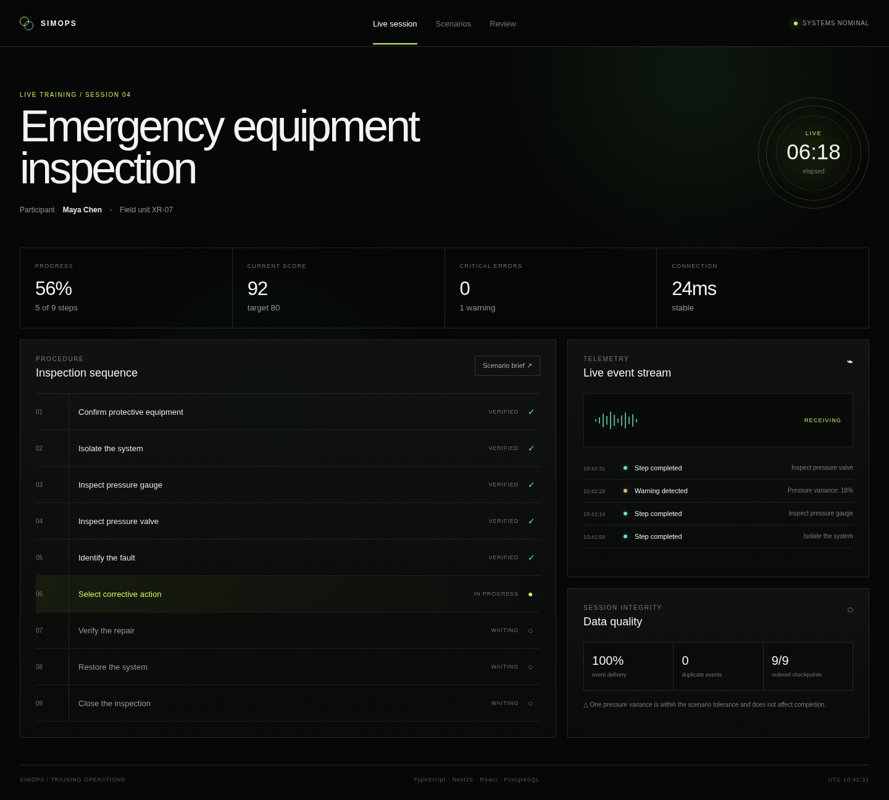

# SimOps

SimOps is an API-first operations console for immersive training and simulation products. It coordinates scenarios and live sessions, accepts telemetry from an external simulation client, processes events asynchronously, calculates performance metrics, and gives operators a clear view of session progress and outcomes.



The project is intentionally focused on one complete vertical slice instead of a broad feature list:

**Create scenario -> launch session -> stream telemetry -> process events -> update the dashboard -> score the session -> review evidence**

## Why I built it

The interesting engineering problem is not the dashboard. It is the contract between an unreliable external simulation client and a backend that needs to remain correct when events arrive late, repeat, or reconnect after a network interruption.

SimOps treats telemetry as retry-safe input. Every client event has a stable `eventId`, PostgreSQL enforces uniqueness, ingestion acknowledges duplicates without applying them twice, and a worker handles scoring and projection updates outside the request path.

The included simulator stands in for a Unity client so the integration can be reviewed and exercised without requiring a Unity runtime.

## Stack

- TypeScript
- NestJS
- Next.js and React
- PostgreSQL and Prisma
- Redis and BullMQ
- Redis pub/sub and Socket.IO for live operator updates
- Docker Compose
- Jest and Playwright

## Architecture

```text
Simulation client / TypeScript emulator
                  |
                  | JSON telemetry
                  v
            NestJS API
             |      |
             |      +--> PostgreSQL
             |
             +--> Redis / BullMQ --> Worker --> scoring + projections
                                      |
                                      +--> live session updates
                                               |
                                               v
                                      Next.js operator console
```

## Quick start

For the fastest review, start the complete stack with Docker:

```bash
docker compose up --build
```

Then run the simulation client from the host:

```bash
npm install
npm run sim
```

The operator console opens at `http://localhost:3000`. The API runs on `http://localhost:4000`.

For local development without containerizing the application code, copy `.env.example` to `.env`, start `postgres` and `redis` with Docker Compose, install dependencies, generate Prisma, then run `npm run dev`.

## Demo flow

The seed route creates an emergency equipment inspection scenario and starts a live session. The simulator then emits realistic step, decision, warning and completion events. The dashboard updates as telemetry is processed and shows completion, score, elapsed time and critical errors.

## Reliability decisions

### Idempotent ingestion

Every telemetry event carries a client-generated `eventId`. The database has a unique constraint on this value. A retry therefore returns an accepted duplicate response instead of creating a second event or inflating the score.

### Fast request path

The API validates and stores telemetry, then pushes the event to BullMQ. Scoring, projections and live status updates happen in the worker so ingestion does not wait for downstream processing.

### Shared contracts

The web app, API, worker and simulator share the same event contracts. This keeps event names, payloads and lifecycle states aligned across the system.

## Design approach

The interface is designed for an operator who needs to understand a live training session quickly. It uses a dark, high-contrast visual system, restrained fluorescent accents, large numeric status cues, clear hierarchy, visible system state and minimal decorative chrome. The goal is a focused operations surface that feels at home around immersive simulation software rather than a generic admin template.

## Repository map

```text
apps/api        NestJS API and Prisma schema
apps/web        Next.js operator console
apps/worker     BullMQ processing and scoring
apps/simulator  TypeScript simulation client emulator
packages/contracts  shared domain contracts and scoring helpers
docs            architecture and decision records
preview         standalone visual preview
```

## Notes

This is a compact proof-of-work project. Authentication, multi-tenant administration and large-scale analytics are deliberately outside the demo scope so the core session and telemetry path stays easy to inspect.
